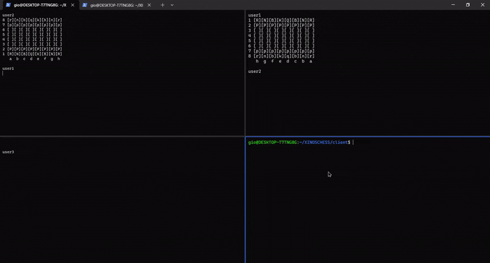

# XinosChess  

Terminal based C++ Linux chess server / client supporting multiple users.<br />
Using slightly modified https://github.com/georginio2000/xinoschess/ for the chess logic.


Live demo available using:
```
ssh chess@ikonomoug.com
```



