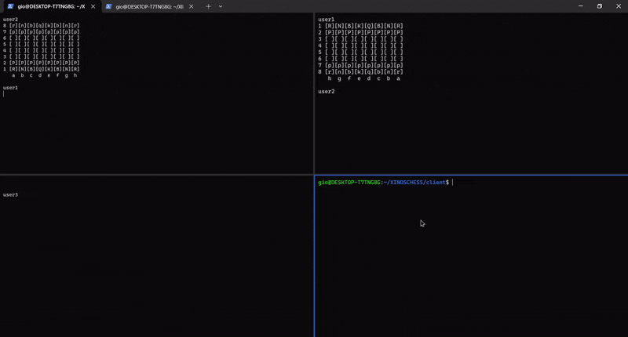

# XinosChess  

Terminal based C++ Linux chess server / client using epoll.<br />
Using slightly modified https://github.com/georginio2000/xinoschess/ for the chess logic.<br />
This is a toy project as an exercise in building a server/client/protocol architecture using epoll, basic C/C++ and syscalls.

Live demo available using:
```
server down
```



